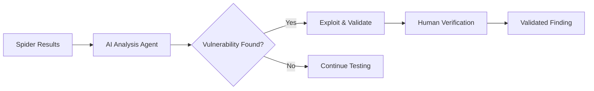

Phase 2 of Indie Security's assessment leverages AI agents to identify, exploit, and validate vulnerabilities across your application surface discovered in Phase 1.

## Overview

The Analysis Phase combines AI-driven testing with human analyst verification:



## Analysis Modes

<Tabs>
  <Tab title="Auto Mode">
    **Best for**: Continuous security monitoring
    
    The AI agent autonomously:
    - Prioritizes high-risk endpoints
    - Chains vulnerabilities together
    - Adapts testing based on findings
    - Optimizes for coverage vs depth
    
    <Info>Recommended for CI/CD integration and regular assessments.</Info>
  </Tab>
  <Tab title="Vuln Testing">
    **Best for**: Targeted security checks
    
    Focused testing against specific categories:
    - Select vulnerability types to test
    - Ideal for regression testing
    - Verify specific security controls
    
    ```bash
    # Example: Test only injection vulnerabilities
    POST /api/assessments
    {
      "mode": "vuln_testing",
      "categories": ["sqli", "xss", "cmdi"]
    }
    ```
  </Tab>
  <Tab title="APT/Adv">
    **Best for**: Comprehensive security audits
    
    Advanced persistent threat simulation:
    - Extended analysis time
    - Attack chain discovery
    - Business logic testing
    - Full OWASP coverage
    
    <Warning>May take several hours for complex applications.</Warning>
  </Tab>
</Tabs>

## Vulnerability Categories

<AccordionGroup>
  <Accordion title="Injection Attacks">
    - **SQL Injection**: Error-based, blind, time-based, UNION-based
    - **NoSQL Injection**: MongoDB, Redis command injection
    - **Command Injection**: OS command execution
    - **LDAP Injection**: Directory traversal
    - **XPath Injection**: XML document exploitation
  </Accordion>
  <Accordion title="Cross-Site Scripting (XSS)">
    - **Reflected XSS**: URL parameter reflection
    - **Stored XSS**: Persistent script injection
    - **DOM-based XSS**: Client-side JavaScript manipulation
    - **Template Injection**: Server-Side Template Injection (SSTI)
  </Accordion>
  <Accordion title="Access Control">
    - **IDOR**: Insecure Direct Object References
    - **Privilege Escalation**: Vertical/horizontal access bypass
    - **Forced Browsing**: Unauthorized resource access
    - **Function-Level Access**: Missing authorization checks
  </Accordion>
  <Accordion title="Server-Side Attacks">
    - **SSRF**: Server-Side Request Forgery
    - **XXE**: XML External Entity injection
    - **File Inclusion**: LFI/RFI vulnerabilities
    - **Path Traversal**: Directory traversal attacks
  </Accordion>
  <Accordion title="Business Logic">
    - **Race Conditions**: TOCTOU vulnerabilities
    - **Workflow Bypass**: State manipulation
    - **Parameter Pollution**: HTTP parameter injection
    - **Mass Assignment**: Object property manipulation
  </Accordion>
  <Accordion title="Authentication & Session">
    - **Session Management**: Fixation, prediction, hijacking
    - **Password Policies**: Weak credentials
    - **Multi-Factor Bypass**: 2FA implementation flaws
    - **JWT Attacks**: Algorithm confusion, key leakage
  </Accordion>
</AccordionGroup>

## Exploitation Evidence

Each validated finding includes comprehensive evidence:

<CardGroup cols={2}>
  <Card title="Proof of Concept" icon="flask">
    Working exploit code that demonstrates the vulnerability.
  </Card>
  <Card title="Screenshots" icon="camera">
    Visual evidence of successful exploitation.
  </Card>
  <Card title="Request/Response" icon="arrows-left-right">
    Full HTTP traffic showing the attack and response.
  </Card>
  <Card title="Impact Analysis" icon="explosion">
    Business impact assessment and risk scoring.
  </Card>
</CardGroup>

<ResponseExample>
```json Finding Example
{
  "id": "vuln_abc123",
  "type": "sql_injection",
  "severity": "critical",
  "endpoint": "POST /api/users/search",
  "parameter": "query",
  "payload": "' OR '1'='1",
  "evidence": {
    "request": "POST /api/users/search HTTP/1.1...",
    "response": "HTTP/1.1 200 OK...[500 user records]",
    "screenshot_url": "/evidence/vuln_abc123.png"
  },
  "business_impact": "Full database access - all user records exposed",
  "remediation": "Use parameterized queries..."
}
```
</ResponseExample>

## Human Analyst Verification

Critical findings receive human review:

<Steps>
  <Step title="AI Detection">
    AI agent identifies potential vulnerability and creates initial finding.
  </Step>
  <Step title="Automated Validation">
    Exploit is verified through successful execution.
  </Step>
  <Step title="Confidence Scoring">
    Finding receives confidence score (Low/Medium/High/Critical).
  </Step>
  <Step title="Human Review">
    Security analyst verifies high-impact findings and refines context.
  </Step>
  <Step title="Remediation Guidance">
    Detailed fix recommendations with code examples added.
  </Step>
</Steps>

## Real-Time Monitoring

Track analysis progress from the dashboard:

- Live vulnerability count
- Coverage percentage
- Endpoints tested vs remaining
- Attack success rate

<Tip>
  Enable notifications to receive alerts when critical vulnerabilities are discovered.
</Tip>

## Next Steps

<CardGroup cols={2}>
  <Card title="Managing Findings" icon="list-check" href="/guides/findings">
    Learn how to triage and remediate discovered vulnerabilities.
  </Card>
  <Card title="Generate Reports" icon="file-pdf" href="/guides/reports">
    Create stakeholder-ready PDF reports.
  </Card>
</CardGroup>
