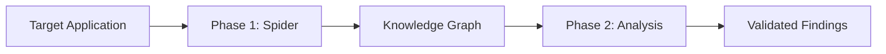
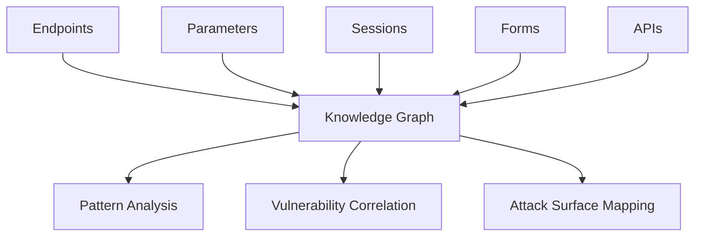

Indie Security uses a two-phase approach combining intelligent crawling with deep AI-powered security analysis. This guide explains our architecture and how our agents work together.

## Two-Phase Approach

Our security testing methodology is designed to maximize coverage and accuracy:

<Columns cols={2}>
  <Card title="Phase 1: Spider" icon="spider">
    Map your entire application surface. Every endpoint, every parameter, every state.
    
    - Human researchers with Burp Extension
    - ECHO-01 AI Crawler
    - Session capture and auth flows
  </Card>
  <Card title="Phase 2: Analysis" icon="magnifying-glass-chart">
    AI + Human analyze the collected data. Find vulnerabilities others miss.
    
    - AI Analysis Agent
    - Human analyst verification
    - Proof-of-concept exploitation
  </Card>
</Columns>

## ECHO-01 AI Crawler

Our proprietary AI crawler intelligently maps application surfaces:

<AccordionGroup>
  <Accordion title="Intelligent Navigation">
    ECHO-01 understands application context and user flows, navigating like a real user rather than blindly following links.
  </Accordion>
  <Accordion title="State-Aware Crawling">
    Tracks application state across sessions, handling complex multi-step workflows and form submissions.
  </Accordion>
  <Accordion title="Authentication Handling">
    Automatically maintains sessions, handles token refresh, and re-authenticates when needed.
  </Accordion>
  <Accordion title="API Discovery">
    Identifies REST, GraphQL, and WebSocket endpoints from JavaScript analysis and traffic observation.
  </Accordion>
</AccordionGroup>

## AI Analysis Agent

Our analysis engine tests for comprehensive vulnerability categories:

<CardGroup cols={3}>
  <Card title="Injection Attacks" icon="syringe">
    SQL, NoSQL, Command, LDAP, XPath injection
  </Card>
  <Card title="Cross-Site Scripting" icon="code">
    Reflected, Stored, DOM-based XSS
  </Card>
  <Card title="Access Control" icon="lock">
    IDOR, privilege escalation, forced browsing
  </Card>
  <Card title="SSRF" icon="server">
    Server-side request forgery variants
  </Card>
  <Card title="Business Logic" icon="brain">
    Race conditions, workflow bypass, state manipulation
  </Card>
  <Card title="Authentication" icon="key">
    Session management, credential stuffing, brute force
  </Card>
</CardGroup>

## Knowledge Graph Architecture

All discovered data flows into a Neo4j knowledge graph:

<Tip>
  The knowledge graph enables cross-target analysis—finding patterns that single-target scans miss.
</Tip>

## Assessment Modes

<Tabs>
  <Tab title="Auto Mode">
    **Best for**: Regular monitoring and CI/CD integration
    
    Fully autonomous testing using AI-driven decision making. The agent prioritizes high-risk areas and adapts testing based on discovered vulnerabilities.
  </Tab>
  <Tab title="Vuln Testing">
    **Best for**: Focused vulnerability scanning
    
    Targeted testing against specific vulnerability categories. Ideal when you need to verify particular security controls.
  </Tab>
  <Tab title="APT/Adv">
    **Best for**: Major releases, compliance requirements
    
    Advanced persistent threat simulation with extended analysis time, attack chaining, and comprehensive coverage.
  </Tab>
</Tabs>

## Human-in-the-Loop

While AI drives the analysis, human experts validate critical findings:

<Steps>
  <Step title="AI Detection">
    AI agent identifies potential vulnerabilities through automated testing.
  </Step>
  <Step title="Confidence Scoring">
    Each finding receives a confidence score based on exploit success.
  </Step>
  <Step title="Human Verification">
    Security analysts verify high-impact findings and refine false positives.
  </Step>
  <Step title="Remediation Guidance">
    Detailed fix recommendations with code examples.
  </Step>
</Steps>

## Next Steps

<CardGroup cols={2}>
  <Card title="Spider Phase" icon="spider" href="/guides/spider-phase">
    Deep dive into Phase 1 capabilities.
  </Card>
  <Card title="Analysis Phase" icon="magnifying-glass" href="/guides/analysis-phase">
    Explore Phase 2 testing methodology.
  </Card>
</CardGroup>
