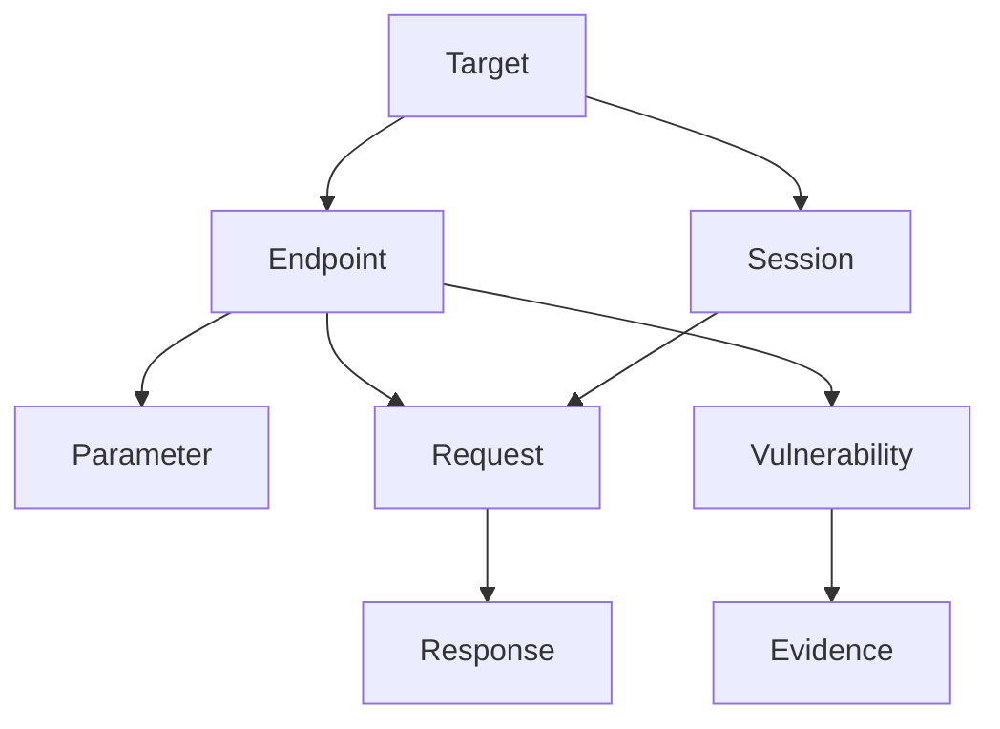

Indie Security stores all discovered data in a Neo4j knowledge graph, enabling advanced querying and pattern analysis.

## Overview

<CardGroup cols={2}>
  <Card title="Relationship Mapping" icon="share-nodes">
    Visualize connections between endpoints, parameters, and vulnerabilities.
  </Card>
  <Card title="Pattern Analysis" icon="magnifying-glass-chart">
    Query across assessments to find recurring vulnerability patterns.
  </Card>
  <Card title="Cross-Target Insights" icon="layer-group">
    Discover shared vulnerabilities across multiple applications.
  </Card>
  <Card title="Custom Queries" icon="terminal">
    Write Cypher queries for custom security analysis.
  </Card>
</CardGroup>

## Connecting to Neo4j

<Steps>
  <Step title="Get Connection Details">
    Navigate to **Dashboard** → **Settings** → **Integrations** → **Neo4j**.
    
    ```text
    URI: bolt://graph.indiesecurity.com:7687
    Username: your_org_id
    Password: (generated)
    ```
  </Step>
  
  <Step title="Connect with Neo4j Browser">
    Open Neo4j Browser and connect:
    
    ```text
    :server connect
    URL: bolt://graph.indiesecurity.com:7687
    Username: your_org_id
    Password: your_password
    ```
  </Step>
  
  <Step title="Verify Connection">
    Run a test query:
    
    ```cypher
    MATCH (n) RETURN count(n) LIMIT 1
    ```
    
    <Check>You should see a count of nodes in your graph.</Check>
  </Step>
</Steps>

## Data Model

The knowledge graph uses this schema:



### Node Types

| Node Type | Description |
|-----------|-------------|
| `Target` | Root node for each target application |
| `Endpoint` | Discovered URL/API endpoint |
| `Parameter` | Input parameter (query, body, header) |
| `Request` | Captured HTTP request |
| `Response` | HTTP response data |
| `Vulnerability` | Discovered security issue |
| `Evidence` | Proof of exploitation |
| `Session` | Authentication session |

### Relationships

| Relationship | Description |
|--------------|-------------|
| `HAS_ENDPOINT` | Target → Endpoint |
| `HAS_PARAMETER` | Endpoint → Parameter |
| `SENT_REQUEST` | Session → Request |
| `RECEIVED_RESPONSE` | Request → Response |
| `HAS_VULNERABILITY` | Endpoint → Vulnerability |
| `HAS_EVIDENCE` | Vulnerability → Evidence |

## Example Queries

<AccordionGroup>
  <Accordion title="Find all endpoints with SQL injection">
    ```cypher
    MATCH (t:Target)-[:HAS_ENDPOINT]->(e:Endpoint)
          -[:HAS_VULNERABILITY]->(v:Vulnerability)
    WHERE v.type = 'sql_injection'
    RETURN t.name, e.path, v.severity
    ORDER BY v.severity DESC
    ```
  </Accordion>
  
  <Accordion title="List parameters vulnerable to XSS">
    ```cypher
    MATCH (e:Endpoint)-[:HAS_PARAMETER]->(p:Parameter),
          (e)-[:HAS_VULNERABILITY]->(v:Vulnerability)
    WHERE v.type = 'xss' AND v.parameter = p.name
    RETURN e.path, p.name, p.type, v.payload
    ```
  </Accordion>
  
  <Accordion title="Find endpoints with multiple vulnerabilities">
    ```cypher
    MATCH (e:Endpoint)-[:HAS_VULNERABILITY]->(v:Vulnerability)
    WITH e, count(v) as vulnCount
    WHERE vulnCount > 1
    RETURN e.path, vulnCount
    ORDER BY vulnCount DESC
    ```
  </Accordion>
  
  <Accordion title="Cross-target vulnerability patterns">
    ```cypher
    MATCH (v1:Vulnerability)<-[:HAS_VULNERABILITY]-(e1:Endpoint)
          <-[:HAS_ENDPOINT]-(t1:Target),
          (v2:Vulnerability)<-[:HAS_VULNERABILITY]-(e2:Endpoint)
          <-[:HAS_ENDPOINT]-(t2:Target)
    WHERE v1.type = v2.type AND t1 <> t2
    RETURN v1.type, count(DISTINCT t1) as affectedTargets
    ```
  </Accordion>
</AccordionGroup>

## Python SDK

Query the graph programmatically:

```python
from neo4j import GraphDatabase

driver = GraphDatabase.driver(
    "bolt://graph.indiesecurity.com:7687",
    auth=("your_org_id", "your_password")
)

def get_critical_findings(target_name):
    with driver.session() as session:
        result = session.run("""
            MATCH (t:Target {name: $target})
                  -[:HAS_ENDPOINT]->(e:Endpoint)
                  -[:HAS_VULNERABILITY]->(v:Vulnerability)
            WHERE v.severity = 'critical'
            RETURN e.path, v.type, v.description
        """, target=target_name)
        return [record.data() for record in result]

findings = get_critical_findings("production-app")
for finding in findings:
    print(f"{finding['e.path']}: {finding['v.type']}")
```

## Security Considerations

<Warning>
  Neo4j access provides read-only access to your security data. Credentials should be kept secure.
</Warning>

- Credentials are scoped to your organization only
- Read-only access by default
- All queries are logged
- Credentials can be rotated in dashboard settings

## Next Steps

<CardGroup cols={2}>
  <Card title="API Reference" icon="code" href="/api-reference/introduction">
    Query data via REST API.
  </Card>
  <Card title="CI/CD Integration" icon="arrows-rotate" href="/integrations/cicd">
    Automate security analysis in pipelines.
  </Card>
</CardGroup>
